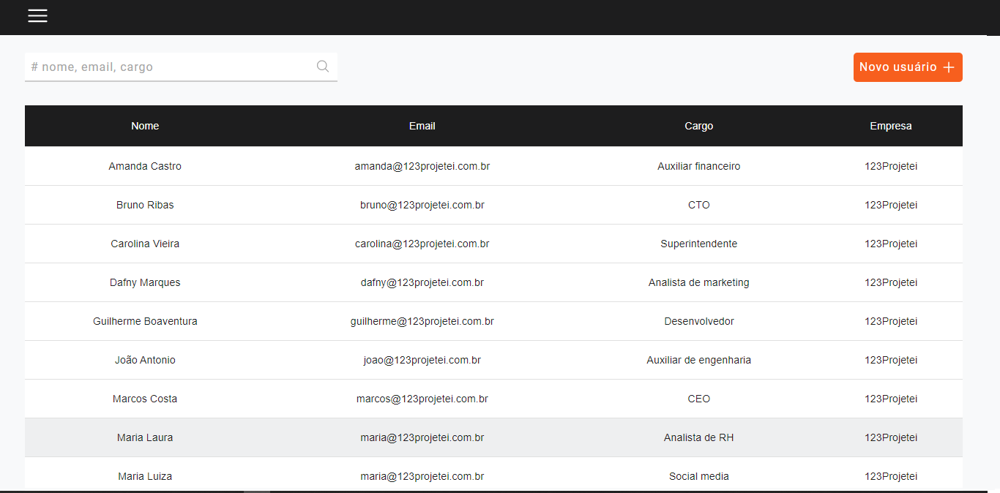
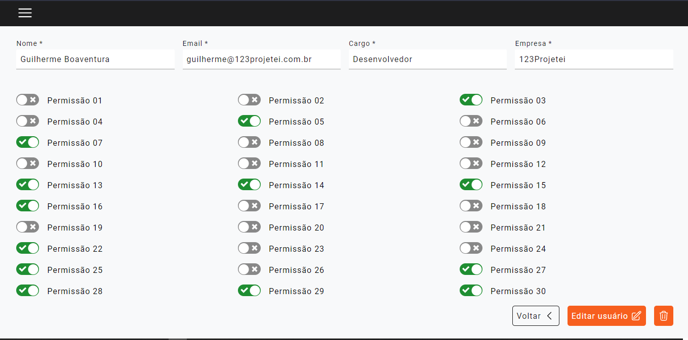
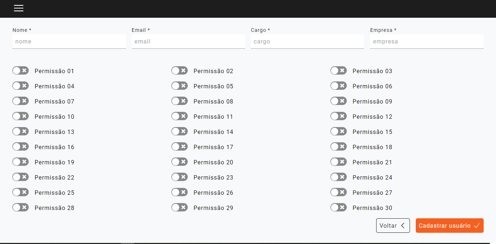

# USER MANAGER

## Sobre

Trata-se de uma aplicação React que gerencia (CRUD) de contas de usuários.

Os dados são encaminhados através do Redux Sagas e persistidos no local storage, simulando um banco de dados.

Os usuários cadastrados contam com informações do cotidiano de qualquer aplicação web, como por exemplo: nome, email, cargo, permissões e afins. Desta forma, conseguimos simular um caso real de uso.

Deixei o arquivo .gitlab-ci.yml para exemplicar um processo de CI/CD onde irá ser executado os pipelines automaticamente e posteriormente o deploy na AWS.

## Link AWS

http://user-manager.com.br.s3-website-us-east-1.amazonaws.com/

## Link Heroku

https://user-manager-gcboaventura.herokuapp.com/

## Funcionalidades

    * Cadastro de usuário
    * Edição de usuário
    * Exclusão de usuário
    * Lista de usuários
    * Pesquisa de usuário

## Credenciais de acesso

email: admin@123projetei.com.br

password: admin123projetei

## Instale as dependências

```
yarn
```

## Husky

```
yarn preapre
```

## Observação

O script `yarn start` serve apenas para o deploy no Heroku. Caso você deseje rodar localmente, siga os scripts abaixo.

## Yarn

```
yarn dev
```

## Build - Yarn

```
yarn build
```

## Build - Docker

```
docker build -t user-manager .
```

## Executando - Docker

```
docker run -p 3000:3000 user-mananger
```

## Images







